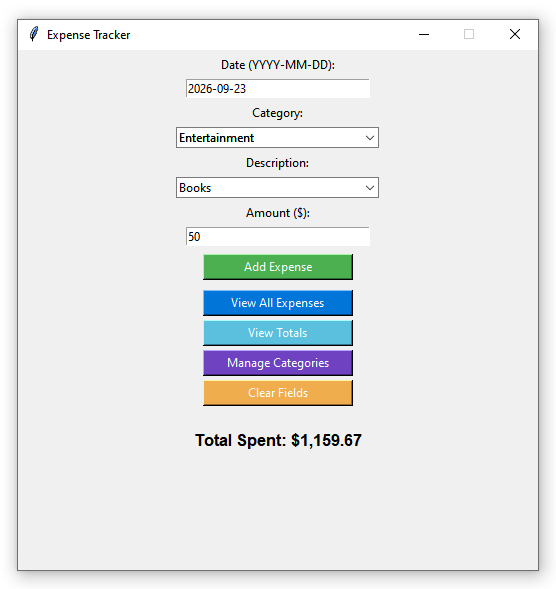
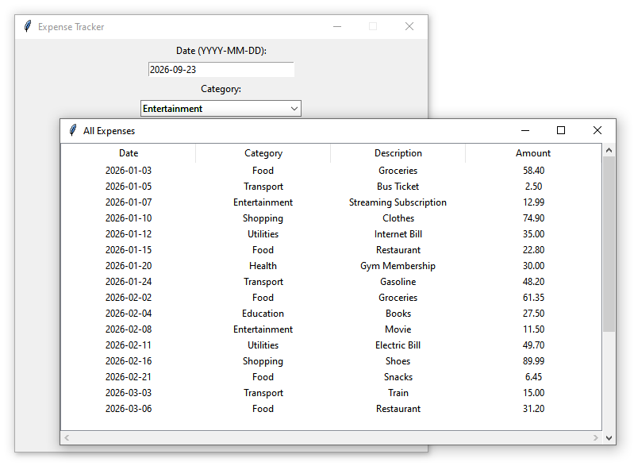
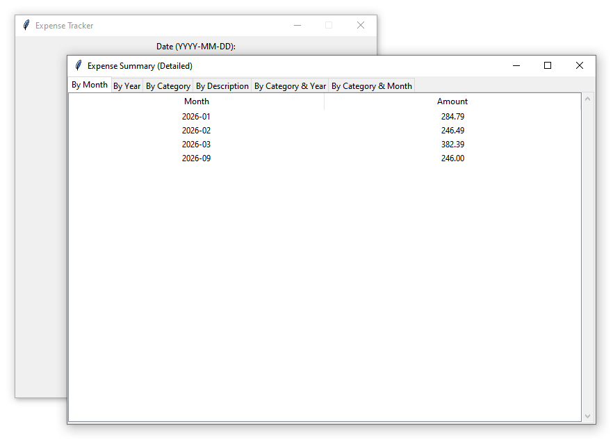

# 💰 Expense Tracker (Python + Tkinter)


## About the Project

Expense Tracker is a desktop application built with **Python**, **Tkinter**, and **Pandas** for recording and organizing personal expenses. The application allows users to categorize expenses, manage descriptions, and view monthly, yearly, category-based, and description-based spending summaries. All data is stored locally in **CSV** and **JSON** files, so the app works completely offline.

---

## Screenshots

### Main Window



### Expense List



### Expense Summary



---

## Features

* Add expenses with a **date**, **category**, **description**, and **amount**.
* Create, rename, move, and delete categories and descriptions.
* View all saved expenses in a sortable table.
* View spending totals by month, year, category, and description.
* Store all data locally in CSV and JSON files.
* Simple and intuitive desktop interface built with Tkinter.

---

## Technologies Used

* Python 3.7
* Tkinter
* Pandas

---

## Requirements

* Python **3.7**
* pandas

Install the required package with:

```bash
pip install -r requirements.txt
```

---

## Project Structure

```text
expense-tracker-python/
├── expense_tracker.py
├── data/
│   ├── expenses.csv
│   └── categories.json
├── screenshots/
│   ├── main-window.png
│   ├── expenses-table.png
│   └── totals-window.png
├── requirements.txt
└── README.md
```

---

## Installation

1. Clone this repository.

2. Install the required dependency:

   ```bash
   pip install -r requirements.txt
   ```

3. Run the application:

   ```bash
   python expense_tracker.py
   ```

---

## Future Improvements

* Export expense summaries to Excel or PDF.
* Add charts for spending by category and month.
* Add a monthly budget and remaining balance tracker.
* Add search and filtering by date, category, or description.
* Add recurring monthly expenses.

---

## License

This project is open source and available under the MIT License.
